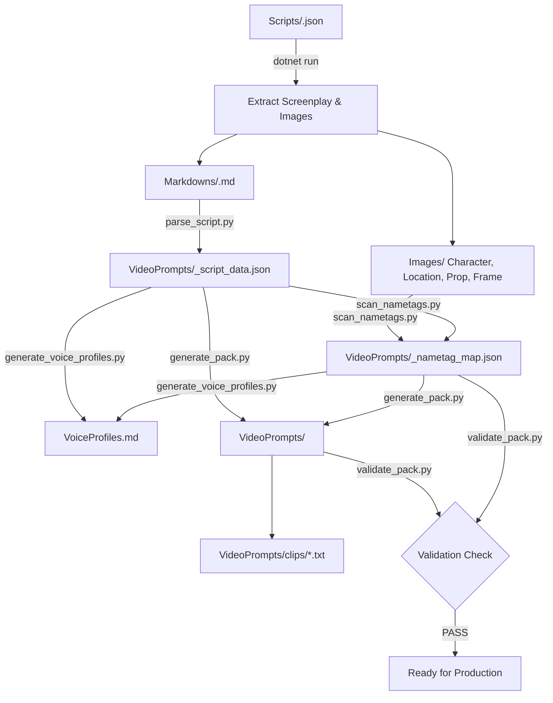

# ScriptParser — Google Storyboard to Google Flow Video Generation Pipeline

An end-to-end automated orchestration pipeline that converts Google Storyboard raw JSON scripts into fully-formed **Google Flow / Omni Flash video-generation prompt packs**, complete with **character voice profiles**, **emotive acting directives**, and **asset nametag mapping**.

---

## Quick Start (Single-Command Execution)

Process any script through the entire 6-stage pipeline in one automated command:

```bash
# Process a specific script
python process_pipeline.py WHAT_THE_LIMIT_WAS_FOR

# Specify target aspect ratio (default: 16:9)
python process_pipeline.py MAN_WHO_BROKE_TOMORROW --ar 9:16

# Process all scripts in Scripts/ in batch
python process_pipeline.py --all

# Skip .NET extraction if assets are already generated
python process_pipeline.py WHAT_THE_LIMIT_WAS_FOR --skip-extract
```

---

## Pipeline Overview



### The 6 Pipeline Stages

1. **.NET Screenplay & Asset Extraction** (`dotnet run -- "<script_name>"`):
   - Extracts formatted screenplay Markdown to `Exports/<script_name>/Markdowns/<script_name>.md`.
   - Reconstructs base64 assets into high-resolution images in `Exports/<script_name>/Images/{Character, Location, Prop, Frame}/`.

2. **Script Data Parsing** (`parse_script.py`):
   - Parses the screenplay markdown into structured JSON (`_script_data.json`) containing scene IDs, shot breakdowns, camera directions, visual descriptions, and dialogue beats.

3. **Asset & Nametag Scanning** (`scan_nametags.py`):
   - Cross-references asset names against image folders.
   - Maps Character and Location assets to `@nametag` ingredients for Google Flow.
   - Identifies frame images to serve as visual ingredient references.

4. **Character Voice Profiles & Audio Directives** (`generate_voice_profiles.py`):
   - Generates `VoiceProfiles.md` detailing:
     - **Acoustic DNA**: Demographics, frequency ranges (Hz), timbres, and pacing (WPM).
     - **Dynamic Vocal Arcs**: Emotional phase transitions across the narrative.
     - **Human-Emotive Dialogue Directives**: Every single dialogue line annotated with acting cues (e.g., `[whispering]`, `[trembling breath]`, `[voice cracking]`, `[monotone]`).
     - **TTS Parameter Matrices**: Stability, Clarity, and Style Exaggeration for ElevenLabs, Gemini Audio, and OpenAI Voice.

5. **Google Flow Video Prompt Pack Generation** (`generate_pack.py`):
   - Formats every shot into an AI video prompt snapped to allowed durations (`4s`, `6s`, `8s`, `10s`).
   - Uses frame images as ingredient references in `**References:**`.
   - Restricts references to Character and Location assets only (Props ignored from references; Narrator formatted as non-diegetic audio only).
   - Generates the master markdown pack and standalone per-clip `.txt` prompt files in `clips/`.

6. **Automated Quality Validation** (`validate_pack.py`):
   - Verifies duration constraints, aspect ratio consistency, reference ingredient syntax, and audio directive compliance.

---

## Directory Structure

```text
ScriptParser/
├── Scripts/                                # Input Google Storyboard JSON files
│   ├── MAN_WHO_BROKE_TOMORROW.json
│   └── WHAT_THE_LIMIT_WAS_FOR.json
│
├── Exports/                                # Generated pipeline outputs
│   └── <script_name>/
│       ├── Markdowns/
│       │   └── <script_name>.md            # Formatted screenplay
│       ├── Images/
│       │   ├── Character/                  # Character reference images
│       │   ├── Location/                   # Location reference images
│       │   ├── Prop/                       # Prop images (baked into frames)
│       │   └── Frame/                      # Shot storyboard frames
│       ├── VoiceProfiles.md                # Voice profiles & dialogue directives
│       └── VideoPrompts/
│           ├── _script_data.json           # Intermediate parsed script data
│           ├── _nametag_map.json           # Asset-to-nametag mappings
│           ├── <script_name>-flow-prompts.md  # Master video prompt pack
│           └── clips/                      # Individual clip text files
│               ├── Scene01_Shot01.txt
│               └── ...
│
├── process_pipeline.py                     # Unified end-to-end Python runner
├── Program.cs                              # .NET storyboard asset extractor
├── ScriptParser.csproj                     # .NET project configuration
└── .agents/
    └── skills/
        ├── process-script/                 # Agent orchestration skill (/process-script)
        └── flow-clip-prompt-generator/     # Prompt generation scripts & validation
```

---

## CLI Options & Usage

```text
usage: process_pipeline.py [-h] [--ar {16:9,9:16,1:1,4:3,21:9}]
                           [--skip-extract] [--all]
                           [script_name]

positional arguments:
  script_name           Name of the script (e.g., WHAT_THE_LIMIT_WAS_FOR)

options:
  -h, --help            Show this help message and exit
  --ar, --aspect-ratio  Target aspect ratio (default: 16:9)
  --skip-extract        Skip .NET extraction if assets already exist
  --all                 Process all scripts found in Scripts/ directory
```

---

## Unattended / Hands-Off Execution

If you want to run the pipeline without having to confirm terminal commands in the IDE:
1. **Enable Terminal Auto-Approval**: In Antigravity IDE Settings (`Ctrl + ,`), search for **Agent Permissions** and enable **Auto-approve terminal commands**.
2. **Use Slash Commands**:
   - `/process-script`: Triggers the interactive workflow.
   - `/goal process script <name>`: Runs the entire process autonomously to completion.
